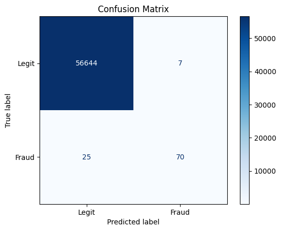
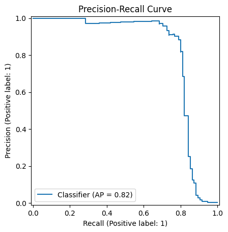
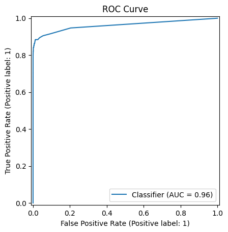

# Credit Card Fraud Detection

End-to-end fraud detection pipeline built on the Kaggle "Credit Card Fraud
Detection" dataset (`Time`, `V1`-`V28`, `Amount`, `Class`): preprocessing,
model training/evaluation, a REST API, a Streamlit dashboard, and a Kafka
producer/consumer pair for scoring a simulated live transaction stream.

## Results

Measured on the held-out test set: **56,746 transactions, 95 of them fraudulent**.
The split is stratified and SMOTE is applied to the *training* fold only, so these
numbers reflect the dataset's natural 0.167% fraud rate rather than a rebalanced one.

| Metric (fraud class) | Score |
| --- | --- |
| Precision | **0.909** |
| Recall | **0.737** |
| F1 | **0.814** |
| ROC-AUC | **0.962** |
| PR-AUC | **0.817** |

70 of 95 frauds caught, at the cost of 7 false positives out of 56,651 legitimate
transactions. Overall accuracy is 0.9994, but that number means little here --
labelling every transaction "legit" already scores 0.998 -- so precision/recall and
PR-AUC are what to read.



| Precision-Recall | ROC |
| --- | --- |
|  |  |

The precision-recall curve is the informative one at this class imbalance; the ROC
curve looks near-perfect largely because true negatives dominate. The decision
threshold is `FRAUD_THRESHOLD` in `src/config.py` (default 0.5) -- lowering it trades
precision for recall.

Regenerate these plots and numbers with `python evaluate.py` from `src/`.

## Project layout

```
data/raw/creditcard.csv     # place the raw Kaggle CSV here
data/processed/              # generated test split (created by preprocessing)
models/                       # trained model.pkl + scaler.pkl (created by train.py)
experiments/                  # evaluation plots (created by evaluate.py)
notebooks/EDA.ipynb           # exploratory data analysis
src/
  config.py                   # paths, feature list, Kafka settings
  preprocessing.py             # load -> scale -> split -> SMOTE balance
  train.py                     # trains and saves the model + scaler
  evaluate.py                  # metrics + plots on the held-out test set
  api.py                       # FastAPI scoring service
  producer.py                  # streams rows of the dataset to Kafka
  consumer.py                  # scores streamed transactions, raises alerts
  dashboard.py                 # Streamlit UI for exploration + batch scoring
docker/
  Dockerfile
  docker-compose.yml           # zookeeper + kafka + api + producer + consumer
```

## Setup

```bash
pip install -r requirements.txt
```

Download the dataset from Kaggle ("Credit Card Fraud Detection") and place
it at `data/raw/creditcard.csv`, or point `FRAUD_RAW_DATA` at wherever it
lives, e.g.:

```bash
export FRAUD_RAW_DATA="D:/archive (6)/creditcard.csv"
```

## Train and evaluate

```bash
cd src
python train.py      # preprocesses the data, trains the model, saves model.pkl/scaler.pkl
python evaluate.py   # prints metrics, saves plots to experiments/
```

## Serve predictions

```bash
uvicorn api:app --app-dir src --host 0.0.0.0 --port 8000
```

`POST /predict` with a JSON body containing `Time`, `V1`...`V28`, `Amount` returns:

```json
{ "is_fraud": false, "fraud_probability": 0.0123 }
```

## Dashboard

```bash
streamlit run src/dashboard.py
```

Explore the dataset and upload a CSV of transactions to score in bulk.

## Streaming (Kafka)

```bash
cd docker
docker compose up --build
```

This starts Zookeeper, Kafka, the API, a `producer` that replays the dataset
onto the `transactions` topic, and a `consumer` that scores each message and
republishes anything above the fraud threshold to `fraud_alerts`.

To run producer/consumer against a local Kafka broker without Docker:

```bash
cd src
python producer.py
python consumer.py
```

## Configuration

All paths, feature columns, and Kafka settings live in `src/config.py` and
can be overridden with environment variables: `FRAUD_RAW_DATA`,
`KAFKA_BOOTSTRAP_SERVERS`, `KAFKA_TRANSACTIONS_TOPIC`, `KAFKA_ALERTS_TOPIC`.
